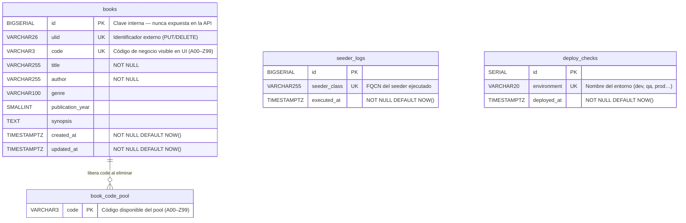

# Arquitectura — Atreyu Library

> Este documento describe la arquitectura de solución del proyecto Atreyu Library,
> sus componentes, capas, patrones de diseño y estrategia de despliegue.

---

## Visión general

Atreyu Library es una aplicación web de tres capas desplegada en Google Cloud Run,
compuesta por un frontend Angular, una API REST en Spring Boot y una base de datos
PostgreSQL administrada en Supabase.

```
┌─────────────────────────────────────────────────────┐
│                    Usuario / Browser                 │
└─────────────────────────┬───────────────────────────┘
                          │ HTTPS
┌─────────────────────────▼───────────────────────────┐
│              Frontend — Angular                      │
│                  Cloud Run                           │
└─────────────────────────┬───────────────────────────┘
                          │ REST / JSON
┌─────────────────────────▼───────────────────────────┐
│              Backend — Spring Boot API               │
│                  Cloud Run                           │
└─────────────────────────┬───────────────────────────┘
                          │ JDBC / SSL
┌─────────────────────────▼───────────────────────────┐
│           Base de datos — PostgreSQL                 │
│                  Supabase                            │
└─────────────────────────────────────────────────────┘
```

---

## Componentes

| Componente | Tecnología | Hosting |
|------------|-----------|---------|
| Frontend | Angular | Google Cloud Run |
| Backend | Spring Boot | Google Cloud Run |
| Base de datos | PostgreSQL | Supabase |
| CI/CD | GitHub Actions | GitHub |
| Calidad de código | SonarCloud | SonarCloud |
| Pruebas E2E | Cypress | Local (nativo, no dockerizado) |
| Contenedores | Docker / Docker Compose | Local / Cloud Run |

---

## Backend

### Capas

La API sigue una arquitectura en capas estricta. Cada capa tiene una responsabilidad
única y se comunica únicamente con la capa adyacente.

```
HTTP Request
     │
     ▼
┌─────────────┐
│ Controller  │  Recibe la request, valida entrada, delega al Service
└──────┬──────┘
       │
       ▼
┌─────────────┐
│   Service   │  Lógica de negocio, orquesta operaciones
└──────┬──────┘
       │
       ▼
┌─────────────┐
│ Repository  │  Acceso a datos — Spring Data JPA
└──────┬──────┘
       │
       ▼
┌─────────────┐
│   Entity    │  Modelo JPA mapeado a tabla PostgreSQL
└─────────────┘

       ↕ (en todos los niveles)
┌─────────────┐
│     DTO     │  Objetos de transferencia Request/Response
└─────────────┘
```

### Reglas

- La **Entity** nunca se expone directamente en la respuesta — siempre se mapea a un DTO
- El **Controller** no contiene lógica de negocio
- El **Service** no conoce detalles de HTTP (request/response)
- El **Repository** no contiene lógica de negocio

### Estructura de paquetes

```
code/backend/
└── src/main/java/com/atreyu/library/
    ├── controller/
    │   └── BookController.java
    ├── service/
    │   └── BookService.java
    ├── repository/
    │   └── BookRepository.java
    ├── entity/
    │   └── Book.java
    ├── dto/
    │   ├── BookRequest.java
    │   └── BookResponse.java
    └── BookCodePool.java
```

### API REST

| Método | Endpoint | Descripción |
|--------|----------|-------------|
| GET | `/api/v1/books` | Lista todos los libros (con filtros opcionales) |
| GET | `/api/v1/books/{id}` | Detalle de un libro por ULID |
| POST | `/api/v1/books` | Crea un nuevo libro |
| PUT | `/api/v1/books/{id}` | Actualiza un libro por ULID |
| DELETE | `/api/v1/books/{id}` | Elimina un libro por ULID |

- Parámetros de búsqueda en `GET /books`: `title`, `author`, `genre`
- El campo `id` en todas las operaciones internas es el **ULID**
- El campo `code` (ej. `A12`) es el identificador visible en UI, no se usa como PK

---

## Frontend

### Estructura

```
code/frontend/
└── src/
    ├── app/
    │   ├── core/
    │   │   └── services/
    │   │       └── book.service.ts     ← HTTP + cache con signals
    │   ├── features/
    │   │   └── books/
    │   │       ├── book-list/
    │   │       ├── book-detail/
    │   │       └── book-form/
    │   └── shared/
    │       └── components/
    └── environments/
```

### Patrones

- **Services**: toda la comunicación HTTP y lógica de estado
- **Signals**: estado reactivo sin NgRx — simple, nativo de Angular
- **Cache**: invalidación después de mutations (crear, editar, eliminar)
- **Smart / Dumb components**: los componentes de feature orquestan, los shared solo presentan

### Estrategia de testing

| Nivel | Herramienta | Qué cubre |
|-------|-------------|-----------|
| Unitario BE | JUnit 5 + Mockito | Service, lógica de negocio |
| Integración BE | Spring Boot Test | Endpoints, repositorios |
| Unitario FE | Jasmine / Karma | Componentes, servicios |
| E2E | Cypress | Flujos completos desde el navegador |

Cypress cubre el happy path de cada operación CRUD contra el ambiente real,
complementando los tests unitarios y de integración.

---

## Base de datos

### Diagrama ER



> **Nota:** `book_code_pool` y `books` no tienen FK a nivel de base de datos por diseño (TD-21):
> la relación se gestiona a nivel de aplicación mediante `SELECT FOR UPDATE SKIP LOCKED`
> para garantizar asignación atómica de códigos bajo alta concurrencia.
> `seeder_logs` y `deploy_checks` son tablas de infraestructura — se eliminarán al
> completar los sprints CRUD.

### Decisiones

- Tres identificadores en `books` con roles distintos (ver [TD-17](technical-decisions/td-17-bigserial-pk-ulid-identificador-externo.md))
  - `id` (BIGSERIAL): PK interna — nunca sale de la BD
  - `ulid`: identificador externo para la API REST
  - `code`: identificador de negocio legible visible en la UI
- `book_code_pool` pre-genera los 2 600 códigos (A00–Z99) para asignación atómica sin reintentos
- Las migraciones se gestionan con **Flyway** (`ddl-auto=none`)
- Los seeders se ejecutan solo en los perfiles `dev`, `qa`, `e2e`, `prod` según corresponda

---

## Infraestructura y ambientes

```
┌──────────────┬──────────────────────────────────────┬─────────────────────────────────┐
│   Ambiente   │ URL                                  │ Descripción                     │
├──────────────┼──────────────────────────────────────┼─────────────────────────────────┤
│ Local        │ localhost                             │ Docker Compose — dev_container  │
│ QA           │ qa01.atreyu-library.pakodiaz.dev     │ Deploy manual por branch        │
│ Producción   │ atreyu-library.pakodiaz.dev          │ Deploy automático al mergear    │
└──────────────┴──────────────────────────────────────┴─────────────────────────────────┘
```

> El prefijo `qa01` permite escalar a múltiples ambientes QA simultáneos (`qa02`, `qa03`)
> si se requiere validar más de un branch en paralelo.

### Docker Compose (local)

El ambiente local corre sobre dos contenedores:

```
docker-compose.yml
├── dev_container  → imagen única con BE (Spring Boot) + FE (Angular)
│                    configurados y listos para desarrollo
└── postgres       → PostgreSQL (imagen independiente, puerto 5432)
```

En local el frontend corre con el dev server de Angular dentro del `dev_container`.
En QA y producción se usa una **imagen nginx independiente** con configuración de
cache para archivos estáticos. Angular genera hashes en los nombres de archivo en
el build de producción, lo que permite cache agresivo (`Cache-Control: max-age=31536000,
immutable`) sin riesgo de servir versiones desactualizadas.

Se incluye configuración de **devcontainer** para desarrollo dentro del contenedor
con soporte en VS Code y JetBrains.

Cypress **no se dockeriza** — se ejecuta directamente en la máquina local
apuntando al ambiente que se quiera probar. Esta decisión es por rendimiento:
Cypress dentro de Docker introduce latencia significativa que afecta la
experiencia de desarrollo.

---

## CI/CD

```
Pull Request abierto
        │
        ▼
┌───────────────────────┐
│   GitHub Actions CI   │
│  ├── Lint (BE + FE)   │
│  ├── Tests (BE + FE)  │
│  └── SonarCloud       │
└──────────┬────────────┘
           │ ¿Checks pasan?
      ✅ Sí │              ❌ No → Merge bloqueado
           ▼
┌───────────────────────┐
│  Review Copilot       │
│  Review Devin         │
└──────────┬────────────┘
           │
           ▼
      Merge a main
           │
           ▼
┌───────────────────────┐
│  GitHub Actions CD    │
│  ├── Deploy Cloud Run │
│  │   (BE + FE)        │
│  └── Cypress E2E      │
│      (smoke test)     │
└───────────────────────┘
```

---

## Diagramas UML

Los diagramas de secuencia para cada operación CRUD se encuentran en:

```
docs/diagrams/
├── sequence-read.md
├── sequence-create.md
├── sequence-update.md
└── sequence-delete.md
```
