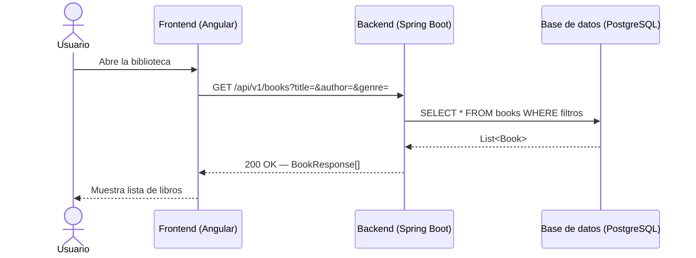
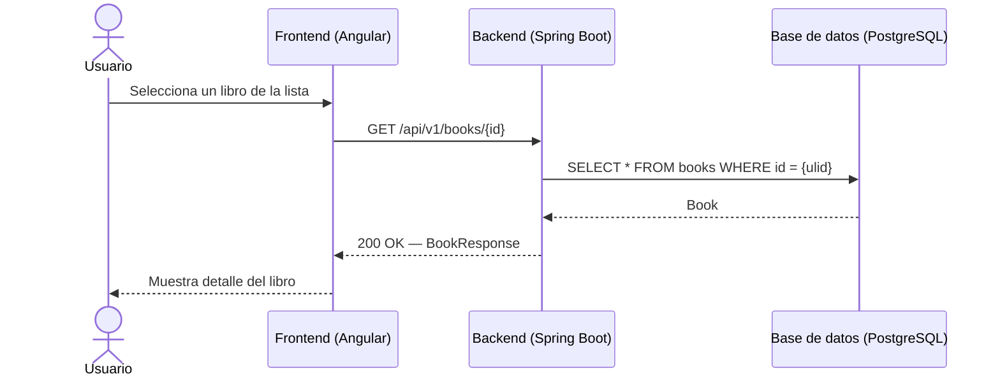
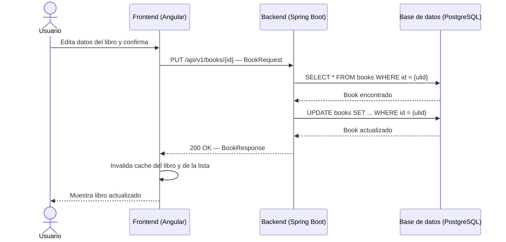
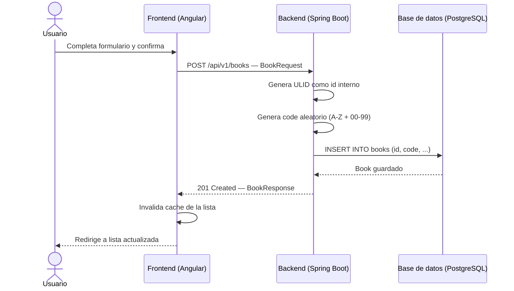
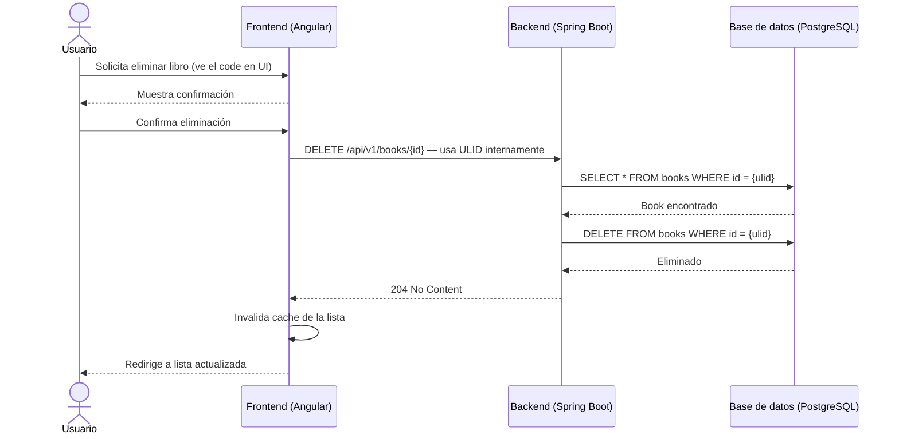

# Diagramas de Secuencia — Atreyu Library

> Diagramas UML de secuencia para cada operación del sistema, generados con Mermaid.

---

## Lectura de libros

### Listar libros

### Ver detalle de un libro

---

## Actualización de un libro

---

## Creación de un libro

---

## Eliminación de un libro

